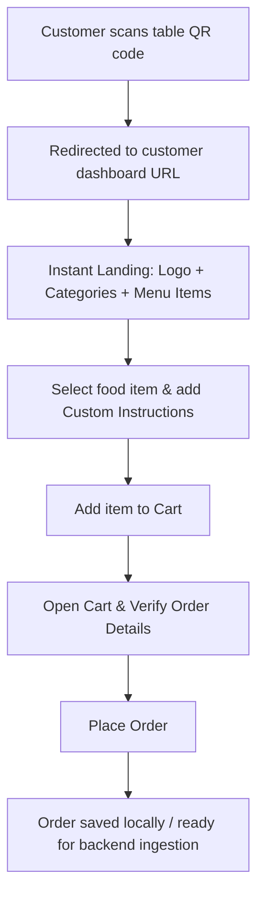
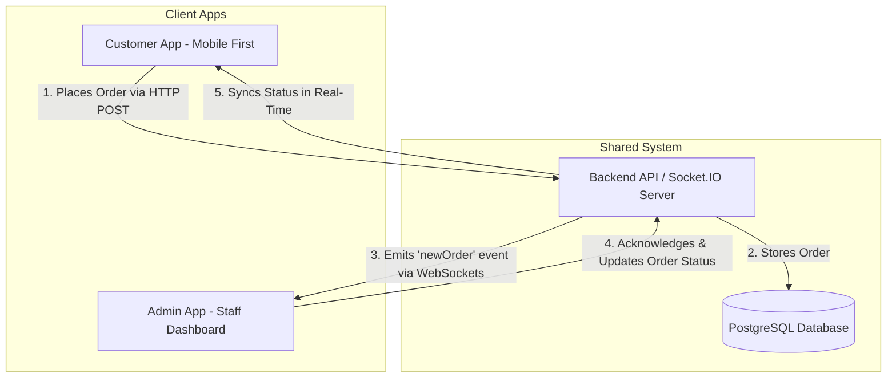

# Product Requirements Document (PRD)
## Smart Restaurant QR Ordering System (Customer Dashboard & Shared Architecture)

### 1. Project Overview
A smart restaurant food ordering system that allows customers to scan a QR code placed on their table and directly access a lightweight, mobile-first customer ordering dashboard without requiring waiter interaction.

The system is designed to:
* **Reduce waiting time** in busy restaurants.
* **Streamline food ordering** pipelines.
* **Improve overall customer experience**.

> [!NOTE]
> This Phase 1 PRD focuses heavily on the **Customer Dashboard** implementation using dummy data, while defining a clean architectural plan that is ready for the future **Admin Dashboard** and a shared **Backend Server**.

---

### 2. Product Goal
Build a modern, scalable, mobile-first customer ordering interface where:
1. **Instant QR Access**: Customers scan a table QR code and are immediately directed to the dashboard.
2. **Menu Browsing**: Instantly browse food categories and items.
3. **Item Customization**: Customize dish instructions (e.g., spice levels, allergies, extras).
4. **Community Feedback**: View lightweight, real-time community reactions on menu items.
5. **Seamless Ordering**: Add items to a cart and place an order directly.

The UI/UX must remain **extremely simple, focused, and distraction-free**.

---

### 3. Project Scope (Phase 1)

#### 🟩 Included (Phase 1)
* **QR-based Access**: Custom routing that encodes table numbers and branch locations.
* **Category Navigation**: Interactive horizontal/vertical scroll categories for quick filtering.
* **Food Item Cards**: Fully detailed cards showcasing image, name, description, price, food type (veg/non-veg), community feedback, custom notes input, and add-to-cart action.
* **Customization Notes**: Textarea/input on every item for customer preferences.
* **Cart System**: Mobile-friendly sticky cart button with options to adjust quantities, read special notes, and calculate real-time pricing.
* **Order Placement**: Fully validated order payloads detailing table number, items, quantities, custom instructions, and timestamps.
* **Community Feedback**: Fast, lightweight reaction metrics for each item.
* **Local Dummy Data**: Self-contained mock menu data for instant loading and future schema compatibility.

#### 🟥 Not Included (Future Scope)
* **Admin Dashboard**: Live order management, kitchen status monitor, inventory, analytics, table configuration, and billing.
* **Live Database/API Integration**: Full integration of PostgreSQL, Prisma, real-time Socket.IO communication, and user/admin authentication (Clerk/Better Auth).

---

### 4. Core User Flow

#### QR Scan Flow


1. **Scan**: Customer scans a QR code placed on the table (e.g., `https://restaurant-app.com/table/12`).
2. **Access**: Browser instantly loads the mobile-optimized customer dashboard.
3. **Browse**: Instantly browse menu categories (Starters, Mains, Biryani, Desserts, etc.).
4. **Customize & Add**: Customer adds custom instructions (e.g., "extra spicy", "no onions") and adds the items to the cart.
5. **Review & Place**: Customer reviews the sticky cart and hits "Place Order", sending the payload containing table number, timestamps, and food items.

---

### 5. Functional & Technical Requirements

#### 5.1 Access & Security
* **No Authentication Required**: Customers should not be forced to register or login.
* **URL Routing**: Routing must parse the table number and branch ID from the URL:
  ```txt
  https://restaurant-app.com/table/{table_number}
  ```
* **Isolation**: Customer routes must be completely isolated from admin dashboard routes. The customer dashboard must not contain any links or entry points to admin features.

#### 5.2 UI/UX Requirements
* **Landing Screen**: Show *only* the Restaurant Name/Logo, Food Categories, and Menu Items. Do not include Profile, About, Blogs, complex settings, or authentication routes.
* **Menu Navigation**: Horizontal scrollable categories that trigger instantaneous filter actions on the menu list.
* **Food Item Cards**:
  * Visual assets (images).
  * Clear Veg/Non-Veg indicators.
  * Price tags.
  * Quick reaction indicators.
  * Integration of a notes input directly inside or within a modal detail view of the item.
* **Lightweight Feedback System**:
  * Metric based on four standardized reactions:
    * **Must Try** ⭐
    * **Very Tasty** 😋
    * **Good** 👍
    * **OK** 🙂
  * Show percentages or counts clearly (e.g., `Must Try ⭐ 48%`, `Very Tasty 😋 32%`).
* **Cart & Checkouts**:
  * Persistent, sticky mobile cart trigger.
  * Itemized lists showing customization notes, quantity control selectors, and grand totals.
  * Simple checkout action with success state representation.

#### 5.3 Technical Stack (Target Production)

| Layer | Customer App (Frontend) | Admin App (Frontend) | Shared Backend / API Server |
| :--- | :--- | :--- | :--- |
| **Framework** | Next.js 15 (App Router) | Next.js 15 (App Router) | Next.js Route Handlers / Express |
| **Language** | TypeScript | TypeScript | TypeScript |
| **Styling** | Tailwind CSS | Tailwind CSS | N/A |
| **UI Kit** | shadcn/ui | shadcn/ui | N/A |
| **State** | Zustand | Zustand | N/A |
| **Animations**| Framer Motion | Framer Motion | N/A |
| **Database** | N/A | N/A | PostgreSQL + Prisma ORM |
| **Real-time** | Socket.IO client | Socket.IO client | Socket.IO server |
| **Auth** | None | Better Auth / Clerk | Middleware protection |

---

### 6. Architectural Diagram & Data Structures

#### Shared Communication Architecture


#### Menu Data Schema (Example)
```typescript
interface MenuFeedback {
  mustTry: number;
  veryTasty: number;
  good: number;
  ok: number;
}

interface MenuItem {
  id: string;
  name: string;
  category: string;
  price: number;
  image: string;
  veg: boolean;
  description: string;
  feedback: MenuFeedback;
}
```

#### Order Payload Schema (Example)
```typescript
interface OrderItem {
  itemId: string;
  quantity: number;
  customInstructions?: string;
}

interface OrderPayload {
  tableNumber: string;
  branchId?: string;
  items: OrderItem[];
  timestamp: string;
  status: 'PENDING' | 'PREPARING' | 'READY' | 'SERVED';
}
```

---

### 7. MVP Deliverables & Success Criteria

#### MVP Deliverables
1. **Fully responsive customer ordering app** built with Next.js 15, React, TypeScript, and Tailwind CSS.
2. **State Management** implementation using Zustand for cart operations (adding, updating quantities, instructions, and calculations).
3. **Table routing system** to automatically parse table numbers from the URL parameters.
4. **Mock Database** file loaded locally containing diverse menu categories, dishes, and ratings.
5. **Interactive UI** with animated transitions (Framer Motion) and beautiful, minimal design components.

#### Success Criteria
* Ordering takes **under 1 minute** from scanning to placing an order.
* Ultra-fast mobile performance (target first-load under **2 seconds**).
* Simple, high-contrast, distraction-free interface matching premium design aesthetics.
* Completely prepared folder structure and schemas for future integration with the backend server and admin dashboard.
